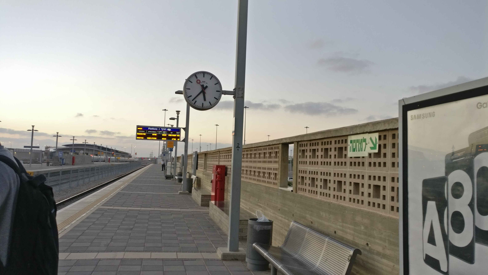
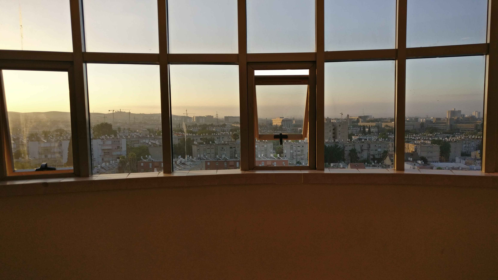
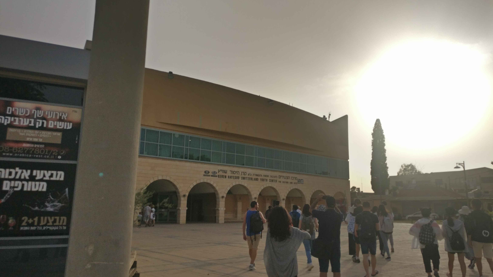
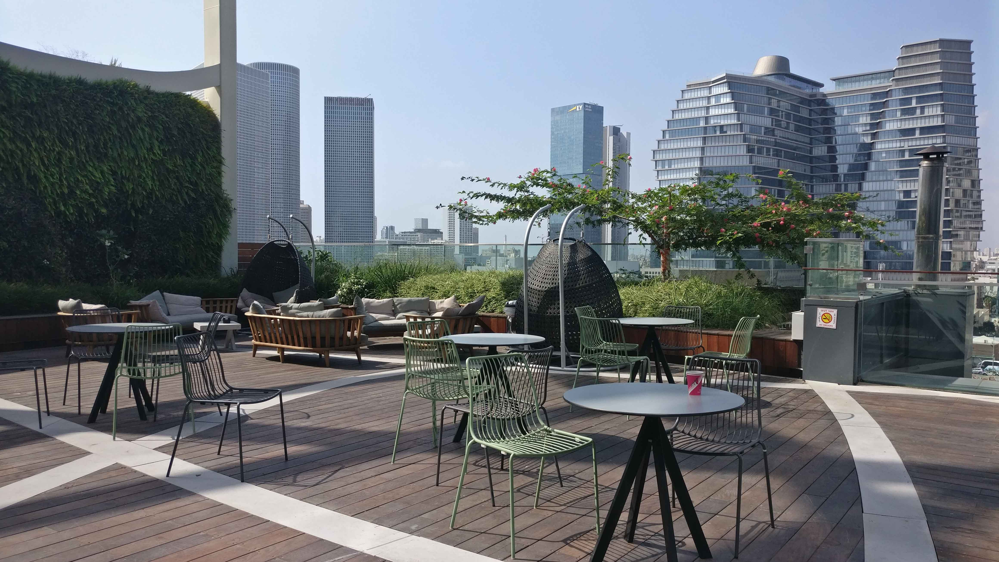
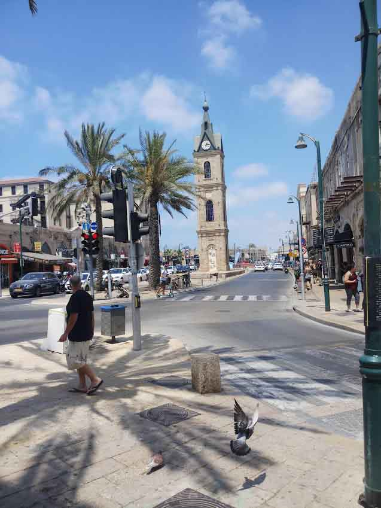

# Thy eternal summer shall not fade

_Sometimes we need to look beyond what we believe exists and what is possible for ourselves. We can do this by allowing ourselves to open our eyes to new possibilities._

Last Summer I got a phenomenal opportunity to explore places beyond my country, an opportunity that taught me many lessons, an opportunity that made me do many adventures, an opportunity to explore different cultures and people, an opportunity that left me with an indelible experience that I would cherish my whole life.

Last summer I got a chance to attend "Data mining and BI for Cybersecurity" summer school at Ben-Gurion University of the Negev, Israel.

*The upshot of my experience*: It's not the destination where you end up but the mishaps and memories you create along the way, the whole experience was enriching, magical, intense, scary. The experience paved me a way to make a difference, a better version of myself.

***The Travel Episode***

After a long process of applying for Ben-Gurion University getting accepted and getting my visa stamped I finally
boarded my flight from Kochi to Tel-Aviv via Delhi (along with my classmate Gopa Vasasnth and Senior Venu Vardhan) with a lot of excitement.

***Whole Israel in a night***

The night I landed in Israel was Shabbat, which means no train, no bus everything was literally shut-down. Finally, we (All the Indians ~20) got a train after the Shabbat was over. We are supposed to get down at the next stop and board another train to reach Beer-Sheva, being an Indian I thought the next stop will be at least 20 to 30 Mins away but I was wrong it was just 5 to 10 mins away, me with a wrong calculation in my mind along with gopa was starring at the beautiful buildings of Tel-Aviv and then suddenly I heard a voice that I should get down, I was in a hurry and ran towards the entrance of the train where I placed my baggage took them and got down, after a timelapse of 30 sec I realized that I left my backpack at the seat where I sat!!! I saw the door in front of me closing and rushed into the next door of the train which was about to close, got my bag ran back to get down but the doors were locked, Me having no money in my hand, No sim card to contact someone, don't know the language was panicked. The in-charge of the train advised me to drop down at the next station and get the next train on the next platform, I got down at the next station and was confused about what to do. Suddenly to my surprise I got a message from Venu anna in telegram!! Thanks to Israels free Railway Wi-Fi, Venu anna messaged me the same thing as the in-charge said, and also added "COME BACK SAFELY WITH TWO BAGS" at last, First I thought that it was a typo after a second gopa also texted me "DID YOU GET THE BAGS??", guess what Gopa also forgot his backpack!! I don't know that. After a moment my counselor messages me to know by when I'll be reaching the university.....I told him about the situation, he made a WhatsApp call to me and spoke with the Incharge of the Station, He also said the same thing - go to the other platform and get the next train, If there is any problem he told me to tell his name "DAVID", then I got the next train I reached my friends and Priya chechi who are waiting for me. In the meantime they enquired about how to get the lost bag, they told us to go to the last stop of the Israel "NAHRIA". Me, Gopa, Venu anna and Priya chechi (who wished to accompany us) took the next train to Nahria at around 22:00 and reached the destination at around 00:00 we got down the train and talked to the station master and we got the bag safely!!! Now it's time to get to our University which is in the opposite corner of Israel, again we boarded the train at 1:00 and had to change to another train in between to get to Beer-Sheva, We boarded the next train which is supposed to stop at Beer-Sheva north (Closest station to our university) and yeah, as usual, we got another surprise it didn't stop.....It went straight to Beer-Sheva central by that time it was almost 5:00 the next day....we again went to the station master and got the right info about which train to board and boarded the train got down at Beer-Sheva north and saw the sun rising and watching at us in a sarcastic way, from there we got a taxi to our dorms finally! The dorms were amazing BTW!

***The Campus***

Coming to the campus life, It's just enriching you can see students from all over the globe and faculty taking classes in shorts, ***Internet speed touching 1.5 Gbps*** :)...State of the are library, the faculty were amazing and friendly too. Honorable mention for the coffee making machines in every class, if you are a coffee lover you'll definitely enjoy listening to class with a hot coffee whenever you are sleepy.

***The Classes***

The classes started with an intro to ML and data-mining followed by ML for Cybersecurity, basics of Blockchain, etc. I felt that the classes were a little fast-paced but then my background in cybersecurity help me to follow the lectures. All the people who took classes for us were notable in the field of cybersecurity and ML, they gave us an overview about their research too along with the regularly scheduled classes, we also got previews for their talks in blackhat 2019 from some of the faculty (and also from some startups which I will talk later in this post)

The strength of whole class was 40 I guess and Indians + Chinese made more than 50% of the class lol!!, there were people from Greece, Spain, Mexico, USA, Chile, etc (4 Israelis too), this gave me an opportunity to explore different cultures and being the youngest among all the students of the class I took freedom to ask some crazy questions, Most of the class were graduates with majority of the Chinese doing their M.S in Maths, a Professor from Chile, Researchers from Japan, etc. I'm literally the kid of the class ;)

Special Mentions: Moran, Ben (Israelies); Angel (Spain); Pepe (Mexico); Patricio (Chile); Xiao Xiao Ma (China); Taniya, Naveen (Indians); Peggy (Taiwan, not my course tho :P)

***Life in Beer-Sheva***

The campus is located in the city of Beer-Sheva it's not a big city, in-fact I accidentally crossed the city when I went out for a casual walk once, But the city!! man the entire city has an odor, The market near our dorms was the best place to hang out in free time, but the old-city is no exception.

***The Dead-Sea***

Our first field trip hehe!! on the way to the Dead sea we visited Ein-Gedi, the Negev, The tomb and house of Ben-Gurion. You can find Mahatma Gandhi's portrait in Ben-Gurion's bedroom. As Apple says "There are crazy people we can't just ignore because they push the human race forward and while some may see them as crazy ones we see them as genius", I would say Ben-Gurion is one of them. There's so much I can write about him but I'll stop it here.

Finally! the Dead-Sea with Jordan on the other side is the lowest place on earth with water having salt content abnormally high, the abnormality is so high that we can float on water, you can't just enter the Dead sea without shoes because of the salt crystals covering the entire earth below water.

The Sabbath: We had our first sabbath near the dead sea, one of the most important parts and the part which I love is the Sabbath dinner. The Dinner starts with a prayer and alcohol followed by a grand dinner. Although I didn't like the main course of Israelis the desserts will standout.

***The Jerusalem***

Aaaaahh!! Jerusalem, what should I tell about Jerusalem......Umbrella Street? The Western Wall? The Last Supper? The Jaffa Gate? The Sun-set at Mt. Olives? The Garden Tomb? The Night-life?? 

We stayed in Jerusalem for 2 days, after our visit to The Wester wall and other important places we went to the Jerusalem Night Market, we celebrated Naveen's bday there. 

“TRAVELING – IT LEAVES YOU SPEECHLESS, THEN TURNS YOU INTO A STORYTELLER.” – IBN BATTUTA 

Each and every place I visited in Jerusalem, there is a story to tell but I don't want to make this blog a big book. So, I'll stop it here, but believe me, you can see a glow in my eye's when I hear the word "Jerusalem".

***The IV***

They took us to Tel-Aviv, where almost all the companies and start-ups were clustered, the companies we visited are Verint, Checkpoint, and IBM (Beer-Sheva).

They are very happy to receive us and share with us the work they are doing, and also gave us an overview regarding the real-world threats that a lot of companies face each day.

***The Final Project, Test, and Graduation***

As Gopa was busy with his GSoC 2019 project Venu anna and I had to do the major part of the project, we successfully finished the project and presented at the IT Center of the Beer-Sheva, then came the test. No one of us was really prepared for the test, but every one of us was able to make it out somehow. Finally the Graduation day yay!! all of us took our graduation in our traditional clothes, You can find Chinese and Indian's catching everyone's eye in the university, as our traditional clothing it quite unique compared to other countries.

***The Tel-Aviv and Haifa***

After graduation day, we (Venu anna, Gopa, Me, Taniya and Swapnil) left to Haifa. The beauty of Haifa just swept me off my feet. I didn't get much time to explore Haifa completely, but the whole city looked like a finely crafted art piece for me.

Haifa - Bahá'í Gardens and the beaches are a must-visit place in Haifa.

Tel-Aviv - The silicon valley of the middle east, The party land, The city that never sleeps....they call it and yeah that's true. We (Me, Gopa and Venu anna) spent 2 days in Tel-Aviv, we stayed at Chetana Amma's house for the two days. Who's a follower of Mata Amritanandamayi. She's so happy to receive us, she treated us like her grandchildren and she also took us for their family Shabbat dinner as well :),. I'm so happy to have someone who made us feel like home in Israel, the conversation that I had with her the night before I left Israel is something very valuable for me, she shared her experience and the lessons she learned in her long journey of 70 years. The last two days were amazing, emotional and adventurous.

***The FOOD***
 
 Coming to food... where ever you go to Israel you'll find Hummus and Falafel, I don't like hummus personally but it really depends on the brand, but Falafel is something that tastes good among the Israeli food, I survived mostly on falafel, the meat doesn't look that fresh, but you'll find Shawarma everywhere again the freshness depends on the place where you buy it, I found meat in Jerusalem good compared to any other place in Israel. The whole experience of food is not great for me, it was okayish. But if you're a fan of desserts you'll find heaven there trust me.

***Back to INDIA***

I would say I've made a great decision applying to this university. The exposure, the friends, the experience and the knowledge I gained here is priceless. Anytime in the future, if I ever want to have a great holiday I'll definitely fly to Israel and complete the things I wanted to do but didn't work out due to lack of time like visiting Eilat, Bethlehem, partying in Tel-Aviv, etc. With great respect towards the Nation, Ben-Gurion and big sack of life-lasting memories I took the flight back to India.

