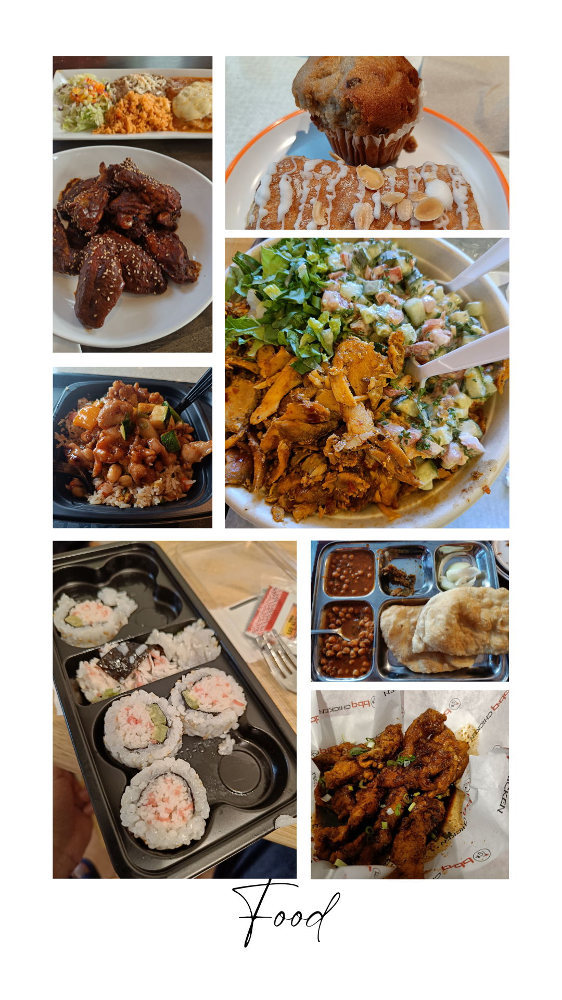
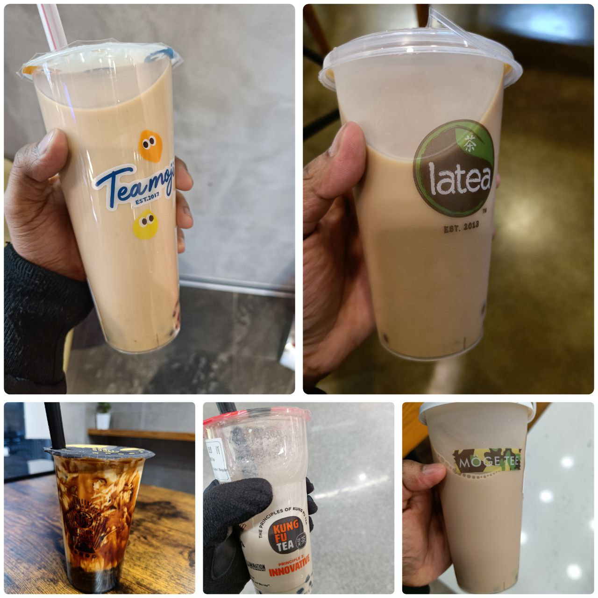
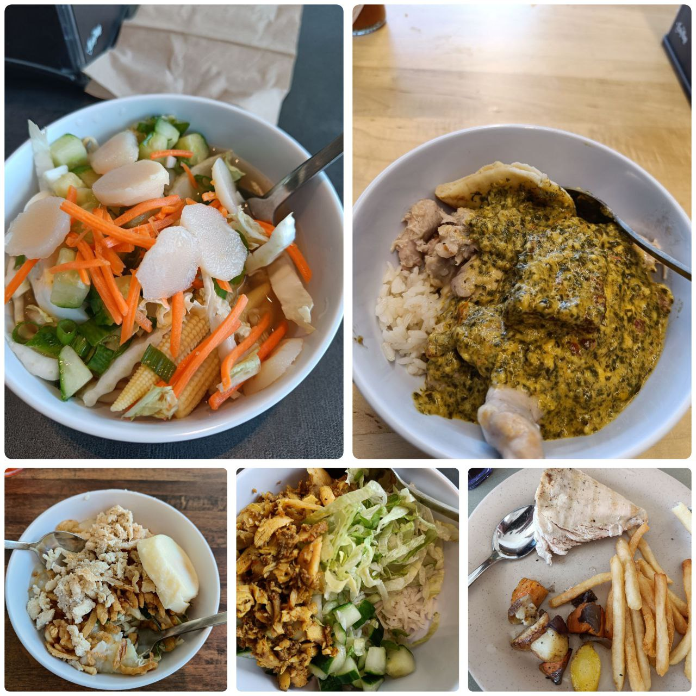
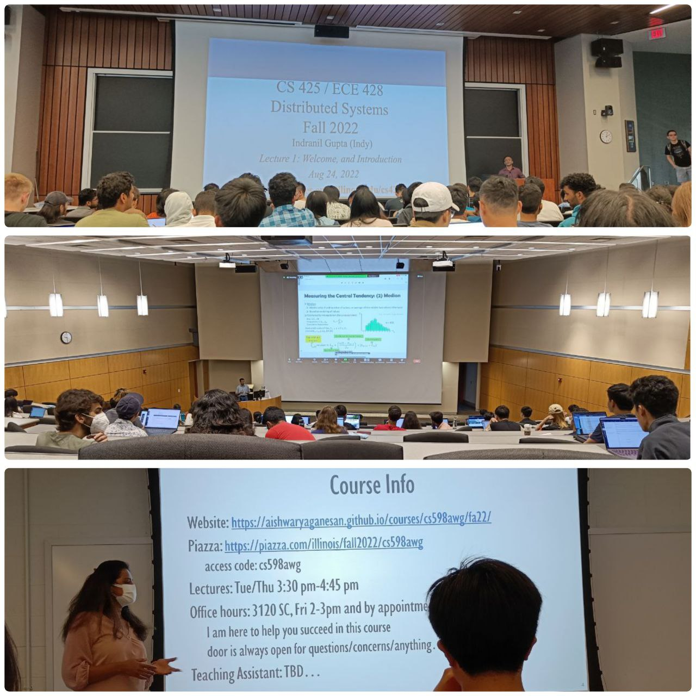
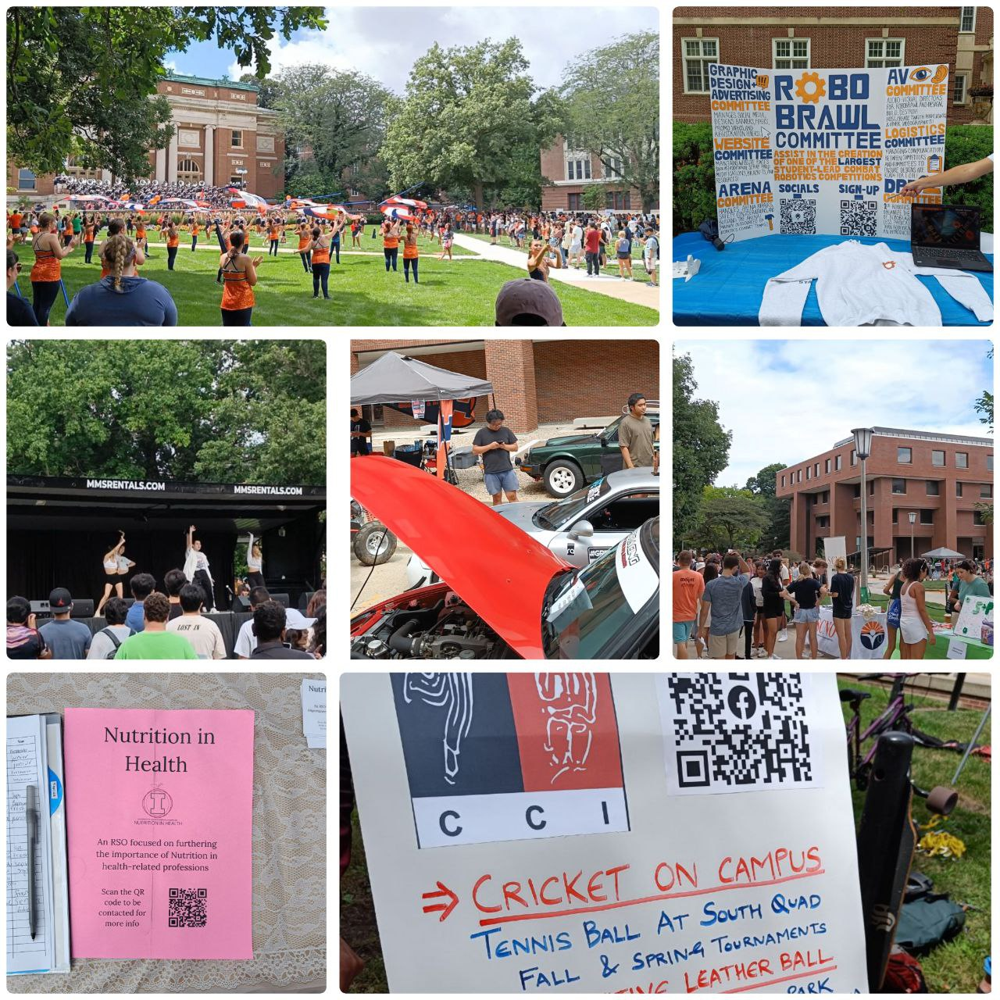
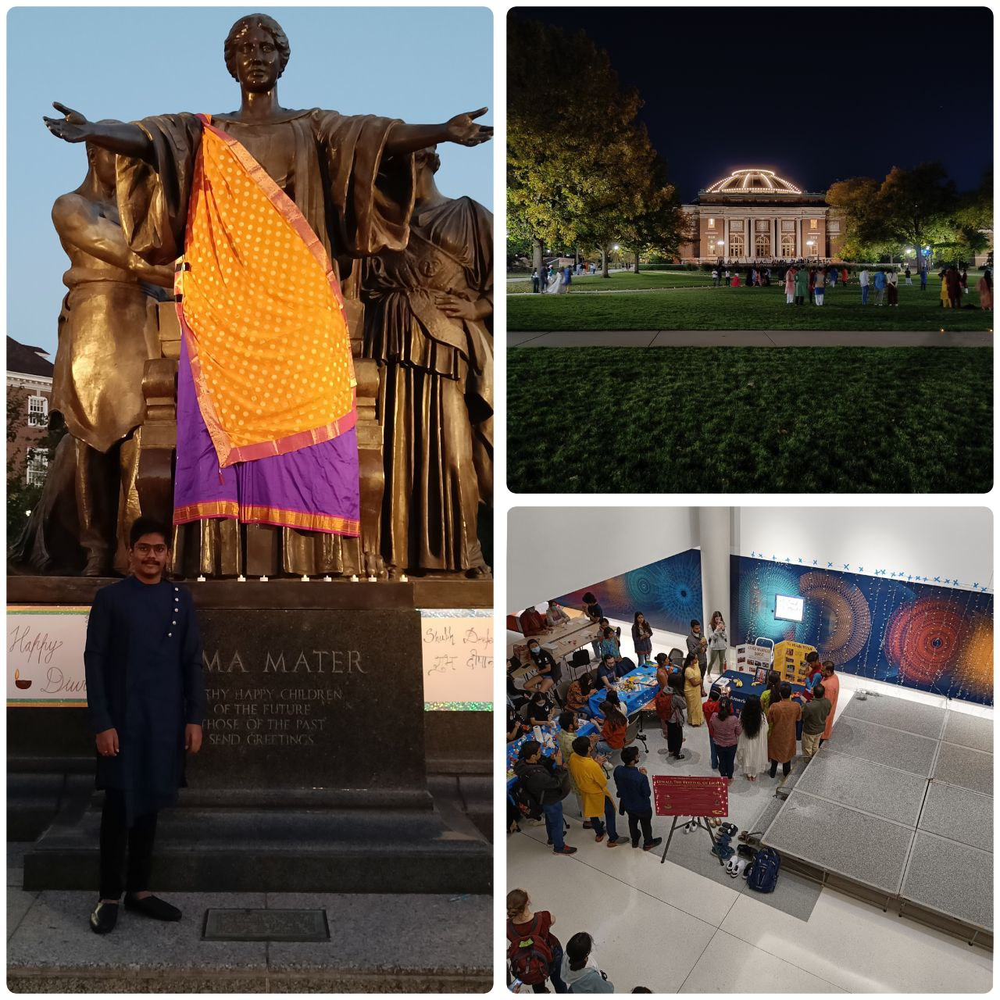

<link rel="stylesheet" href="../css/sem1.css">
<h2>My First semester experience at UIUC as an International Student</h2>

*"Navigating a new culture and environment can be both exciting and challenging, but with the support of friends and a willingness to try new things, the journey can lead to personal and academic growth."*

As an international student from India, my first semester at the University of Illinois at Urbana-Champaign (UIUC) was filled with a mix of excitement and challenges.

One of the biggest challenges I faced was adjusting to the new culture and environment. I also had to get used to the cold weather, as it was a stark contrast to the hot and humid climate I was used to.

Another challenge was navigating my coursework and academic expectations. The course load at UIUC was significantly higher compared to what I was used to in India, and I had to work hard to keep up with the demanding schedule. However, I received a lot of support from my friends and flat mates Manoj and Phani, which helped me to not only survive, but thrive in my courses.

Overall, my first semester at UIUC was a learning experience that helped me to grow both personally and academically. I am grateful for the opportunity to study at such a prestigious institution and am excited to see what the next few semesters have in store.

<h3>1. Adjusting to a New Culture</h3>

*<b>Iced Water</b>* : One of the most surprising cultural shocks was iced water. In my home country of India, it is not common to drink cold water, especially during the winter months. We typically drink warm or room temperature water, and it is believed that cold water can disrupt digestion and weaken the immune system. However, upon arriving in the United States, I quickly learned that iced water is a staple at almost every restaurant and cafe. It is also common for people to drink cold water at home and at work.

*<b>Food lables</b>* : Another cultural shock was the lack of food labeling as "veg" or "non-veg." In India, it is common for people to follow a vegetarian or non-vegetarian diet, and food products are often labeled as such to make it easier for people to make informed choices about what they eat. This is especially important for those who have dietary restrictions or who follow a specific dietary lifestyle, such as vegetarianism or veganism.

The lack of this labeling in the United States made it more difficult for me to determine which foods were suitable for my dietary preferences. I had to rely on ingredient lists and other information provided on packaging to make informed decisions about what to eat. While this was not necessarily a major challenge, it was something that I had to adjust to and became more mindful of as I shopped for food in my new environment.

*<b>No concept of MRP</b>* : I was surprised to find that many products in the United States do not have a visible price tag. In India, it is mandatory for all products to have a Maximum Retail Price (MRP), which is the highest price at which a product can be sold. This ensures that consumers are not overcharged and can easily compare prices between different retailers.

<h3>2. Food</h3>
  

There were a few things that really annoyed me during my first semester at UIUC. One of the biggest frustrations was the lack of availability of buffalo milk, which is a type of milk that is commonly consumed in India. In India, buffalo milk is considered to be more nourishing and flavorful than cow's milk, and it is a staple in many households. However, it was difficult to find buffalo milk in the United States, and I had to rely on cow's milk instead.

Another thing that really annoyed me was the fact that chicken seemed to be rarely fresh. In India, it is common to purchase and consume fresh, locally-raised chicken, and I was used to the taste and quality of fresh chicken. However, in the United States, I found that chicken was often pre-packaged and seemed to be less fresh than what I was used to. This was disappointing, as chicken is a staple protein in my diet, and I rely on it for nutrition.

During my first semester at UIUC, I had the opportunity to try a variety of local restaurants and cafes that offered a range of cuisines. Here is a more detailed breakdown of my ratings for some of the places I visited:

- Dining Halls:
    - ISR: 3.25/5 (best dining hall for Indians) - The ISR dining hall was my go-to place for meals during my first semester at UIUC. While the food was not always particularly good, it was convenient and provided a good variety of options, including Indian food at least once a week.
    - IKE: 3/5 - IKE dining hall was another option for meals, but I found the food to be less satisfying compared to ISR.
- Indian:
    - Himalayan Chimney: 3.5/5 (best restaurant for Indians) - Himalayan Chimney was my favorite Indian restaurant around UIUC, with good food and a cozy atmosphere.
    - Signature Grill: 3.25/5 (best restaurant for sount Indians) - Signature Grill was another good Indian restaurant, with a focus on southern Indian cuisine.
    - Kohinoor: 2.25/5 - Kohinoor was a disappointment, with average food and poor service.
    - Ambar: 2.25/5 - Ambar was another disappointment, with poor food and a lack of authenticity.
- Chinese:
    - Panda express: 3.5/5 - Panda express was a convenient and reliable option for Chinese food.
    - Chinatown: 0.5/5 - Just dont go there.
- Korean:
    - BBQ Chicken: 3.5/5 - Highly depends on what you order.
- Mexican:
    - Chipotle: 3/5
    - Maize at Illinoi Terminal: 2.5/5
- Mediterranean:
    - Shawarma joint: 4/5 - This restaurant was a great find, with delicious and authentic Mediterranean food. The portion sizes were generous and the prices were reasonable.
    - Dubai Grill: 3.25/5 - his restaurant was a good option for Mediterranean food, with a variety of dishes available. The food was flavorful, but the portion sizes were on the small side.
- American:
    - Chick-fil-A: 3.5/5 - This chain restaurant offered a good selection of American fast food, with reasonable prices and decent portion sizes. The food was generally tasty and satisfying.
- Boba-Tea:
    - Kung Fu Tea - 3.75/5 - This cafe offered strong tea with a good milk to water ratio. The boba tea was delicious and the prices were reasonable.
    - Moge Tea: 3.75/5 - This cafe also offered strong tea with a good milk to water ratio. The boba tea was tasty and the prices were reasonable.
    - Latea: 3.75 - This cafe offered strong tea with more water than milk. The boba tea was still enjoyable, but not as rich as some of the other options.
    - Tigersugar: 3.5/5 - This cafe offered a range of boba tea flavors, with a good balance of tea and milk. The prices are very high copared to others, but the quality was good.
    - Teamoji: 3.5/5 - This cafe offered a variety of boba tea flavors, with a focus on lighter teas and more milk than water. The prices were reasonable and the quality was good.
- Latte:
    - Starbucks at Illini Union: 2.5/5
    - Cafe bene at Urbana: 2.5/5
    - McDonalds McCafe: 1.5/5
    - InfiniTea at ISR: 2.5/5

I tried a variety of food and drinks, but boba tea quickly became my favorite. It's a drink that I continue to enjoy and look forward to experiencing more of in the future.

  

I can't survive without good food and I don't like to eat the same thing every day, so I signed up for a dining plan. I mostly ate at ISR, which is a good option for Indians because they serve Indian food at least once a week, and occasionally twice a week. The Indian food they serve is not particularly good, but it is enough for me. I am okay with any type of food as long as it tastes good, so the average taste doesn't bother me.

Here is a list of the top 5 items that I like at ISR (I don't know their exact names):

- Pho
- Paneer curry
- Halal Congee Rice Soup
- Rice with Shawarma
- Halal Herb Grilled Chicken Breast

  

<h3>3. My Courses and Academic Journey</h3>

- <b>CS425 - Distributed Systems by Indy:</b> This course is one of the most popular at UIUC and I learned a lot from it. Indy starts by introducing various definitions of "Distributed Systems" from various sources and explains the flaws in them before presenting his own definition. He revisits this definition in the final class to demonstrate how it makes more sense in light of the knowledge gained throughout the course. The course covers topics such as peer-to-peer systems, cloud computing, consensus algorithms, timestamps, and stream processing. Each course project builds upon the previous one, so by the end of the course, we have built a distributed system from scratch. I would highly recommend this course to anyone interested in systems or who enjoys exploring interesting problems in computer science.

- <b>CS412 - Introduction to Data Mining by Arindam Banerjee:
</b> This is a good introductory course for those who want to delve into data science. The professor begins with the very basics and provides a strong foundation. However, the expectations for the projects are somewhat unclear. This course may be a good choice for an easy A.

- <b>CS598AWG - ML for Systems by Aishwarya Ganesan:</b> This is a great course for those interested in systems. Each class discusses a current state-of-the-art systems paper and a paper that uses machine learning to solve a problem. It is a very useful and novel class for systems students. The final project was open-ended, allowing us to either use machine learning to solve a systems problem or modify existing state-of-the-art solutions to perform better. I would recommend this course to anyone interested in systems or looking for an easy A.

  

<h3>4. Fun</h3>
To be honest, I dedicated most of my time to academics, leaving relatively little time for fun activities or events.

- <b> Quad Day</b>
One of the highlights of my first semester at UIUC was Quad Day, an annual event held on the first day of classes in the fall semester. As I walked around the Main Quad, I was amazed by the number of student organizations that were present, each with their own booth and information about their group. There were so many different options to choose from, ranging from academic and professional organizations to cultural and social groups.

    I was particularly excited to see all of the cultural organizations, as I was interested in learning more about the diverse backgrounds of my fellow students. I also appreciated the opportunity to see what kind of activities and events each group had planned for the year. There were performances, games, and other activities happening all around the quad, which made for a lively and energetic atmosphere.

    Overall, Quad Day was a great way for me to learn about the many opportunities available on campus and get involved in the UIUC community. It was a fun and informative experience.

  

- <b>Diwali at Quad and ISR</b>: I was happy to be able to participate in the Diwali celebration at the Quad during my first semester at UIUC. As an international student, it was nice to see that such a significant religious festival was being celebrated on such a large scale on campus. Although there were no fireworks, the electric diyas that were distributed for people to place around the quad looked beautiful and added to the festive atmosphere.

    The food at the celebration was not particularly good, as I expected, but it was still a enjoyable experience overall. It was nice to see the ISR organizing a pooja event for the occasion, and it was clear that a lot of thought and effort had gone into making the celebration a success.

  

- <b>Movies</b>: Although there were many Indian and Hollywood movies playing at the nearest theaters during my first semester at UIUC, I was disappointed to find that there were very few that particularly caught my attention. From Brahmāstra being the worst to Avatar 2 being average, it was a disappointing semester for movies in my opinion.

  

<h3>5. Looking Ahead</h3>
As I look ahead to the future, I am filled with both excitement and determination. I am excited to continue my studies at the University of Illinois at Urbana-Champaign and see what new challenges and opportunities lie ahead. I am also determined to make the most of my time here and continue growing both personally and academically.

I am grateful for the experiences and growth I've had so far in my first semester at UIUC and am eager to build upon that foundation. I look forward to exploring more of Champaign-Urbana, making new friends, and discovering all that this amazing institution has to offer.

 
 
 

