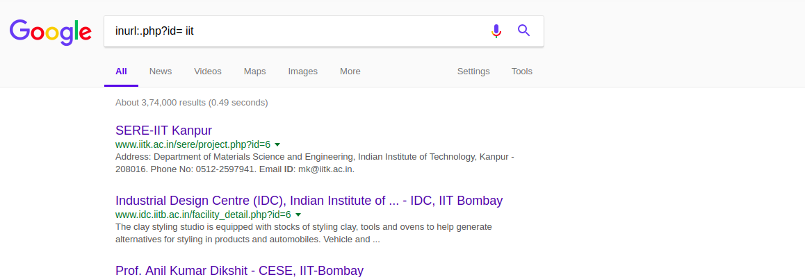
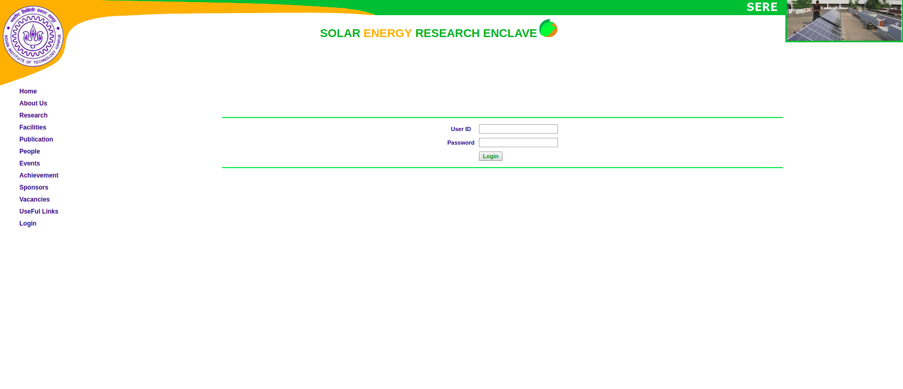
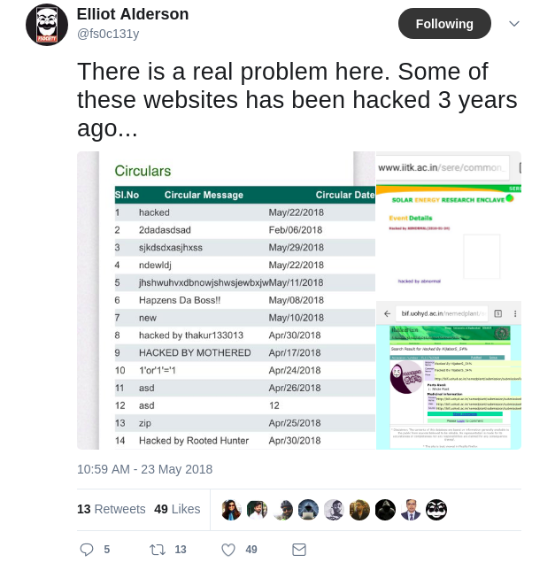

# How Google dorking helped me to find IITk site vulnerable

The very next day I got to know about google dorking I started to dig into some Indian websites login pages. Between I googled for 

    intext:.php?id= iit

Then I found of IIT Kanpur SOLAR ENERGY RESEARCH ENCLAVE. Then I found that there is a login page on the website.

It's a catwalk for those who know basic web exploitation to bypass the login form.I've logged-in into the site bypassing the login check [which I'm not going to say how :p] explored the entire website didn't find anything interesting but after some surfing in the site I found that at the bottom of a page in the site it is written that hacked by abnormal(2014-05-27) then I went into twitter after some searching I found that this site is already reported by Elliot Anderson as vulnerable with a bunch of other sites also. 

I didn't understand why the IITk administration didn't take any further step to secure this site but I found out that Google Dorking is a very useful technique for information gathering.